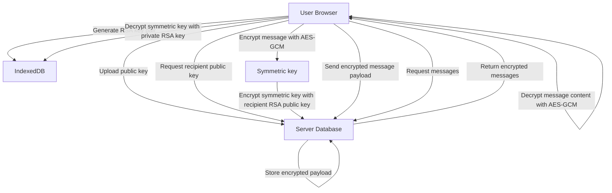

# End-to-End Encrypted Messaging

A prototype Next.js application that demonstrates browser-based end-to-end encrypted messaging using Web Crypto APIs.

## Architecture

The system is split into two main trust zones:

- Client browser: generates and stores a long-term RSA key pair, encrypts messages, decrypts received messages.
- Server API: stores user metadata, public keys, and encrypted message records only.



## Encryption Flow

1. **Key generation**
   - A new RSA-OAEP key pair (4096-bit, SHA-256) is generated in the browser.
   - The public key is exported and sent to the server.
   - The private key is stored locally in IndexedDB and never sent to the server.

2. **Sending a message**
   - The sender requests the recipient's public key from `/api/keys`.
   - The sender generates a fresh AES-GCM symmetric key for the message.
   - The plaintext message is encrypted with AES-GCM using that symmetric key.
   - The symmetric key is encrypted with the recipient's RSA public key.
   - The server receives and stores:
     - `encryptedContent` (AES ciphertext)
     - `encryptedContentIv` (AES IV)
     - `encryptedSymmetricKey` (RSA-encrypted AES key)
     - sender/recipient IDs and metadata

3. **Receiving a message**
   - The recipient fetches messages from `/api/messages`.
   - The browser loads the recipient's private RSA key from IndexedDB.
   - The recipient decrypts the symmetric key with RSA-OAEP.
   - The decrypted AES key is used to decrypt the message content with AES-GCM.

## Key Management

- **Public keys** are stored server-side inside the user record and are available through `GET /api/keys?userId=<id>`.
- **Private keys** remain client-side and are stored in browser IndexedDB via `lib/crypto.ts`.
- The server never persists or transmits a user's private key.
- Each message uses a one-time symmetric AES-GCM key, which is protected by the recipient's long-term RSA public key.

## Security Trade-offs

- ✅ **Confidentiality**: The server cannot read message plaintext because only encrypted data is stored.
- ✅ **Authentication**: Message sender and recipient are bound by authenticated API calls, but the encryption layer does not enforce sender identity beyond application-level auth.
- ✅ **Per-message symmetric keys**: Each message is encrypted with a fresh AES key, reducing reuse risk.

- ⚠️ **No perfect forward secrecy**: If a user's private RSA key is compromised, all previously stored message symmetric keys can be decrypted.
- ⚠️ **Client trust required**: The browser environment and IndexedDB storage are trusted. A compromised client device or browser can leak plaintext or private keys.
- ⚠️ **Public key distribution**: The application trusts the server to return the correct public key; there is no out-of-band public key verification or key fingerprint exchange.
- ⚠️ **Extractable keys**: RSA private keys are marked extractable for export/import operations, which simplifies prototyping but is less secure than non-extractable keys.

## Known Limitations

- Private keys are not synced across devices. Logging in from a new browser does not recover the previous private key, which means prior messages become unreadable unless a key migration mechanism is added.
- No key rotation or revocation process is implemented.
- The server stores encrypted messages and public keys in memory/database but does not validate integrity beyond AES-GCM authentication.
- There is no message integrity/authentication beyond AES-GCM, so metadata like sender/recipient IDs and timestamps are not cryptographically protected.
- The authentication model is basic and should not be used as-is in production.
- The sample app uses browser-only crypto and does not support non-browser clients.

## Getting Started

Install dependencies and start the development server:

```bash
npm install
npm run dev
```

Open `http://localhost:3000` in your browser.

---

## Project Structure

- `app/api/keys/route.ts` — public key upload and retrieval endpoints
- `app/api/messages/route.ts` — fetch stored encrypted messages
- `app/api/messages/send/route.ts` — send encrypted message payloads
- `lib/crypto.ts` — Web Crypto helpers for RSA and AES encryption
- `lib/db.ts` — in-memory/user persistence and message storage utilities
- `components/` — UI and client-side message orchestration
# E2E-Encryption
